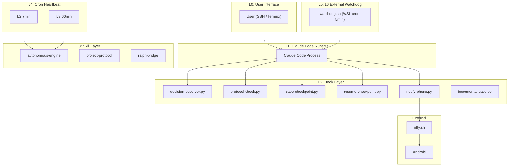

# autodev-engine 架构文档

## 五层防御架构

"Agent 无法抓住自己的生命线" —— 2026 年自主 Agent 领域共识。
autodev-engine 采用五层独立监控，每层由不同机制触发。



## 组件依赖矩阵

| 组件 | 读取 | 写入 | 触发者 |
|------|------|------|--------|
| decision-observer.py | hook data | decision-log.jsonl, autonomous-state.md | UserPromptSubmit, Stop |
| protocol-check.py | tool_input.file_path | calls bootstrap.py | PreToolUse, PostToolUse |
| bootstrap.py | templates/ | CLAUDE.md, PROGRESS.md, GATES.md | protocol-check.py |
| save-checkpoint.py | git, memory, audit | checkpoints/*.json | PreCompact, Stop, SessionEnd |
| resume-checkpoint.py | latest.json | stdout (additionalContext) | SessionStart |
| notify-phone.py | phone-notify.json | ntfy.sh, TCP :9999 | Stop, PostToolUse |
| watchdog.sh | checkpoints/, process | .watchdog_heartbeat | WSL cron 5min |
| autonomous-engine | decision-log, calibration | case-*.json, calibration | CronCreate L2/L3 |

## 决策引擎七阶段循环

OBSERVE -> MATCH -> RESEARCH -> DECIDE -> ACT -> REPORT -> LEARN

信心公式: confidence = pattern_match(0-25) + web_corroboration(0-25) + risk_assessment(0-25) + user_preference_alignment(0-25)

| 分数 | 级别 | 行为 |
|------|------|------|
| 0-10 | OBSERVE | 仅记录 |
| 11-30 | SUGGEST | 建议队列 |
| 31-50 | PREPARE | 准备资源 |
| 51-70 | ACT_NOTIFY | 执行+通知 |
| 71-100 | ACT_SILENT | 静默执行 |

## 检查点格式

```json
{
  "version": "2.0",
  "timestamp": "ISO8601",
  "session_id": "uuid",
  "hook_event": "Stop|PreCompact|SessionEnd",
  "git": { "branch": "...", "status": "...", "last_commit": "..." },
  "memory_files": {},
  "recent_activity": [],
  "cwd": "/path",
  "platform": "win32"
}
```

## 安全硬限制

- 不可修改 settings.json (除恢复已有Hook注册)
- 不可修改 PROTOCOL.md
- 不可删除用户文件
- 连续3次自主行动后强制冷却
- L6 外部看门狗独立进程监控
