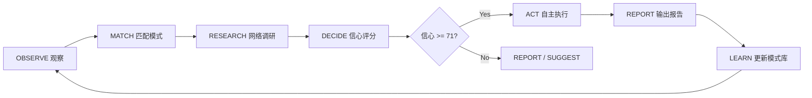

# autodev-engine

**Autonomous Development Engine for Claude Code**

[](LICENSE)
[]()

一个模块化的、可安装的框架，将 Claude Code 从被动助手转变为自主开发副驾驶。

> **v2.0 架构升级：决策引擎运行在独立子 Agent 中，零上下文污染。** 详见 [ARCHITECTURE.md](ARCHITECTURE.md)。

---

## 核心能力

| 能力 | 组件 | 说明 |
|------|------|------|
| 🧠 **决策引擎** | `autonomous-studio` Skill v3.0 | Studio 7阶段流水线 + 双轨架构 + CodeGraph 融合层 + 检查点保护 |
| 📋 **项目协议** | `project-protocol` Skill | 自动为任何项目生成 CLAUDE.md + PROGRESS.md + GATES.md 三件套 |
| 🔄 **会话韧性** | `save/resume-checkpoint` Hooks | SSH 断连自动保存/恢复，三层防护（定时/压缩/退出） |
| 📱 **手机通知** | `notify-phone` Hook | Android 系统通知（ntfy.sh / TCP 隧道 双通道），永不丢消息 |
| 🔗 **SDD 桥接** | `ralph-bridge` Skill | 将 SDD 规划产物翻译为 ralph-v2 可执行格式 |
| 👁️ **外部看门狗** | `watchdog.sh` | L6 系统级监控，运行在 Claude Code 进程之外 |

---

## 五层架构

```
L0: 用户界面 ───── SSH / Termux
L1: Claude Code ──── 运行时
L2: Hook 层 ─────── 事件驱动（6 个 Python Hook）
L3: Skill 层 ────── 按需调用（3 个自定义 Skill + 1 个独立子Agent提示词）
L4: Cron 心跳 ────── 内部定时器（7min + 60min）
L5: 外部看门狗 ──── WSL cron 5min（独立进程）
```

---

## 快速开始

### 前置条件

- Windows 10/11 + WSL2 Ubuntu
- [Claude Code](https://claude.ai/code) (最新版)
- Python 3.10+
- Git + [GitHub CLI](https://cli.github.com/)

**可选：**
- Android + Termux → 手机系统通知
- [Hermes CLI](https://github.com/r-ayin/hermes) → 微信推送

### 安装

```bash
# 1. 克隆仓库
git clone https://github.com/r-ayin/autodev-engine.git
cd autodev-engine

# 2. 复制到你的 Claude Code 工作区（替换 CLAUDE_PROJECT_DIR）
cp -r skills/* "$CLAUDE_PROJECT_DIR/.claude/skills/"
cp hooks/*.py "$CLAUDE_PROJECT_DIR/hooks/"
cp -r engine/* "$CLAUDE_PROJECT_DIR/memory/"

# 3. 合并 Hook 配置
#    将 config/settings.json.example 中的 hooks 段落合并到 .claude/settings.json

# 4. (可选) 部署 L6 看门狗
chmod +x watchdog.sh
crontab -e
#    添加: */5 * * * * /path/to/watchdog.sh >> /tmp/autodev-watchdog.log 2>&1
```

详细步骤见 **[SETUP.md](SETUP.md)**。

---

## 组件清单

### Skills (`.claude/skills/`)

| Skill | 触发词 | Model |
|-------|--------|-------|
| `autonomous-studio` | 自主模式、别等我、继续、studio auto on | sonnet |
| `project-protocol` | 初始化项目、补齐三件套 | haiku |
| `ralph-bridge` | 用 ralph 执行、自动构建 | sonnet |

### Hooks (`hooks/`)

| Hook | 事件 | 功能 |
|------|------|------|
| `decision-observer.py` | UserPromptSubmit, Stop | 分类输入、决策日志、自主上下文注入 |
| `protocol-check.py` | PreToolUse, PostToolUse | 检测三件套缺失 → 自动生成 |
| `save-checkpoint.py` | PreCompact, Stop, SessionEnd | 保存全量检查点 + 轮转 |
| `resume-checkpoint.py` | SessionStart | 检测中断 → 恢复上下文 + 注入固件 |
| `notify-phone.py` | Stop, PostToolUse | Android 通知派遣 |
| `incremental-save.py` | 后台 120s 循环 | 零 AI 参与增量保存 |

---

## 自主决策引擎工作流



**信心评分维度：** 模式匹配 (0-25) + 网络印证 (0-25) + 风险评估 (0-25) + 用户偏好对齐 (0-25)

**行动阈值：**
- 0-10 → OBSERVE (仅观察)
- 11-30 → SUGGEST (建议)
- 31-50 → PREPARE (准备)
- 51-70 → ACT_NOTIFY (执行+通知)
- 71-100 → ACT_SILENT (静默执行)

---

## 安全模型

引擎有硬性安全约束，不可被绕过：

1. **不可修改** `settings.json`（除恢复已有 Hook 注册）
2. **不可修改** `PROTOCOL.md` 或删除用户文件
3. **不可绕过** 门禁检查
4. **连续 3 次** 自主行动后无用户交互 → 强制冷却
5. **L6 外部看门狗** 独立于 Claude Code 进程监控健康

---

## 许可证

MIT — 详见 [LICENSE](LICENSE)

---

🤖 由 [x-tool](https://github.com/r-ayin/x-tool) 工作区孵化
