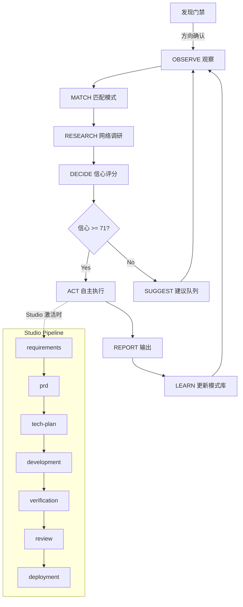

# autonomous-studio

**Autonomous Development Engine for Claude Code — v3.0**

[](LICENSE)
[]()

将 Claude Code 从被动助手转变为自主开发副驾驶。**不只是引擎，是完整的 7 阶段研发流水线操作系统。**

> **v3.0：双轨架构 + 发现门禁 + Studio 7阶段全链路。** Hook 级硬阻断确保流程刚性。详见 [ARCHITECTURE.md](ARCHITECTURE.md)。

---

## 核心能力

| 能力 | 组件 | 说明 |
|------|------|------|
| 🧠 **决策引擎** | `autonomous-studio` Skill v3.0 | 双轨架构(L2 7min+L3 60min) + Studio 7阶段流水线 + CodeGraph融合层 + 检查点保护 |
| 🚧 **发现门禁** | `discovery-gate` Hook | 项目初始化时硬阻断技术操作，强制苏格拉底发现协议。Hook 级强制，不可跳过 |
| 📋 **项目协议** | `project-protocol` Skill | 自动为任何项目生成 CLAUDE.md + PROGRESS.md + GATES.md 三件套 |
| 📝 **7阶段技能链** | `skills/` (8个技能·34文件) | idea-exploration → demand-discovery → pm-spec → plan-feature → serial-agent-handoff → prod-deploy |
| 🔄 **会话韧性** | `save/resume-checkpoint` Hooks | SSH 断连自动保存/恢复，三层防护（定时/压缩/退出） |
| 📱 **手机通知** | `notify-phone` Hook | Android 系统通知（ntfy.sh / TCP 隧道 双通道），永不丢消息 |
| 🔗 **SDD 桥接** | `ralph-bridge` Skill | 将 SDD 规划产物翻译为 ralph-v2 可执行格式 |
| 👁️ **外部看门狗** | `watchdog.sh` | L6 系统级监控，运行在 Claude Code 进程之外 |

---

## 7 阶段 Studio 流水线

```
① 需求发现 ──→ ② PRD ──→ ③ 技术方案 ──→ ④ 开发 ──→ ⑤ 验证 ──→ ⑥ 评审 ──→ ⑦ 部署
     │              │           │            │          │         │         │
  idea-         pm-spec    plan-feature   serial-    verify   code-    prod-
  exploration                          agent-handoff         review   deploy
  demand-
  discovery
```

每个阶段有对应的 Skill，引擎自动检测当前阶段并推进。发现门禁在进入 ① 之前强制执行——确保方向讨论先于技术规划。

---

## 五层架构

```
L0: 用户界面 ───── SSH / Termux / Claude Code CLI
L1: Claude Code ──── 运行时
L2: Hook 层 ─────── 事件驱动（9 个 Hook：7 Python + 1 Shell + 1 发现门禁）
L3: Skill 层 ────── 按需调用（10+ 自定义 Skill + 1 独立子Agent提示词）
L4: Cron 心跳 ────── 内部定时器（7min L2 + 60min L3）
L5: 外部看门狗 ──── WSL cron 5min（独立进程）
```

---

## 快速开始

### 前置条件

- Windows 10/11 + WSL2 Ubuntu
- [Claude Code](https://claude.ai/code) (最新版)
- Python 3.10+
- Git + [GitHub CLI](https://cli.github.com/)

**可选：**
- Android + Termux → 手机系统通知
- [Hermes CLI](https://github.com/r-ayin/hermes) → 微信推送

### 安装

```bash
# 1. 克隆仓库
git clone https://github.com/r-ayin/autonomous-studio.git
cd autonomous-studio

# 2. 部署到 Claude Code 工作区
export WORKSPACE="${CLAUDE_PROJECT_DIR:-/path/to/your/workspace}"

# Skills
cp -r skills/* "$WORKSPACE/.claude/skills/"
cp skill/SKILL.md "$WORKSPACE/.claude/skills/autonomous-studio/"
cp skill/decision-agent-prompt.md "$WORKSPACE/.claude/skills/autonomous-studio/"

# Hooks
cp hooks/*.py "$WORKSPACE/.claude/hooks/"
cp hooks/*.sh "$WORKSPACE/.claude/hooks/"

# Commands
cp commands/*.md "$WORKSPACE/.claude/commands/"

# Config
cp -r config/* "$WORKSPACE/.claude/config/"
cp -r memory/* "$WORKSPACE/.claude/memory/"
cp -r decisions/* "$WORKSPACE/.claude/decisions/"
cp -r codegraph/ "$WORKSPACE/.claude/codegraph/"
cp -r scripts/ "$WORKSPACE/.claude/scripts/"

# 3. 注册 Hooks（合并到 .claude/settings.json）
#    参考 config/settings.json.example 中的 hooks 段落

# 4. (可选) 部署 L6 看门狗
chmod +x watchdog.sh
crontab -e
#    添加: */5 * * * * /path/to/watchdog.sh >> /tmp/autodev-watchdog.log 2>&1
```

详细步骤见 **[SETUP.md](SETUP.md)**。

---

## 组件清单

### Skills (`.claude/skills/`)

**流水线技能（按 Studio 阶段排列）：**

| 阶段 | Skill | 触发词 | 说明 |
|------|-------|--------|------|
| ⓪ | `agents-map` | 生成 AGENTS.md | 项目接入·代码库地图生成 |
| ①' | `idea-exploration` | 聊聊想法、帮我扩展 | 发现门禁核心·10段苏格拉底协议 |
| ① | `demand-discovery` | 帮我聊需求、把想法问透 | 需求聊透·成熟度分级路由 |
| ② | `pm-spec` | PRD、产品规格、需求文档 | PRD/产品规格单页输出 |
| ③ | `plan-feature` | 技术方案 | 代码库分析 + 任务分解 + 依赖排序 |
| ④ | `serial-agent-handoff` | 串行执行 | Worker 链式开发 + 审查门禁 |
| ⑦ | `prod-deploy` | 部署、上线 | 9阶段状态机·全自动分批部署 |

**引擎与辅助技能：**

| Skill | 触发词 | 说明 |
|-------|--------|------|
| `autonomous-studio` | 自主模式、别等我、继续 | v3.0 主引擎·双轨调度 |
| `project-protocol` | 初始化项目、补齐三件套 | 三件套自举生成 |
| `ralph-bridge` | 用 ralph 执行 | SDD→ralph-v2 桥接 |
| `zujianfuyon` | 从组件仓库拉取 | 组件复用库 |
| `memory` | 记住、回忆 | 跨会话持久记忆 |

### Hooks (`hooks/`)

| Hook | 事件 | 功能 |
|------|------|------|
| **`discovery-gate.py`** 🆕 | UserPromptSubmit, PreToolUse, Stop | **发现门禁硬阻断** — 项目初始化时拦截技术操作，强制苏格拉底协议 |
| `decision-observer.py` | UserPromptSubmit, Stop | 分类输入、决策日志、自主上下文注入 |
| `protocol-check.py` | PreToolUse, PostToolUse | 检测三件套缺失 → 自动生成 |
| `check-planning-status.sh` 🆕 | PostToolUse (git commit) | 检查 status.json 是否同步更新 |
| `save-checkpoint.py` | PreCompact, Stop, SessionEnd | 保存全量检查点 + 轮转 |
| `resume-checkpoint.py` | SessionStart | 检测中断 → 恢复上下文 + 注入固件 |
| `notify-phone.py` | Stop, PostToolUse | Android 通知派遣 |
| `auto-commit.py` | PostToolUse | 自动 conventional commit |
| `codegraph-sync.py` | SessionStart, PostToolUse | CodeGraph 索引同步 |
| `incremental-save.py` | 后台 120s 循环 | 零 AI 参与增量保存 |

---

## 引擎决策循环



**信心评分维度：** 模式匹配 (0-25) + 网络印证 (0-25) + 风险评估 (0-25) + 用户偏好对齐 (0-25)

**行动阈值（按操作类型分档）：**
- **可逆操作**：60-70 ACT_NOTIFY / 71-100 ACT_SILENT
- **高风险可逆**：75-85 ACT_NOTIFY / 86-100 ACT_SILENT
- **不可逆**：85-100 ACT_NOTIFY（永不静默）

**发现门禁**：项目初始化 → Hook 硬阻断 → 强制 idea-exploration 10段发现协议 → 方向确认后放行

---

## 安全模型

引擎有硬性安全约束，不可被绕过：

1. **不可修改** `settings.json`（除恢复已有 Hook 注册）
2. **不可修改** `PROTOCOL.md` 或删除用户文件
3. **不可绕过** 门禁检查
4. **连续 3 次** 自主行动后无用户交互 → 强制冷却
5. **L6 外部看门狗** 独立于 Claude Code 进程监控健康

---

## 文件统计

| 指标 | 数值 |
|------|------|
| 总文件数 | 108 |
| Skills | 10 |
| Hooks | 10 |
| 命令 | 1 |
| 决策案例 | 21 |
| 记忆文件 | 8 |

## 许可证

MIT — 详见 [LICENSE](LICENSE)

---

🤖 autonomous-studio v3.0 · 独立仓库 · 由 [x-tool](https://github.com/r-ayin/x-tool) 工作区孵化
